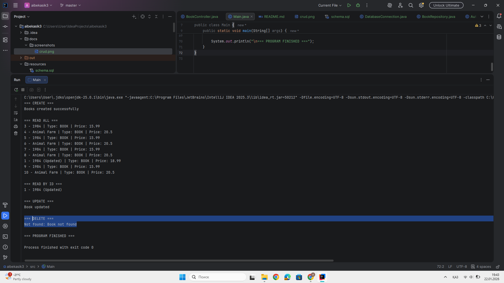
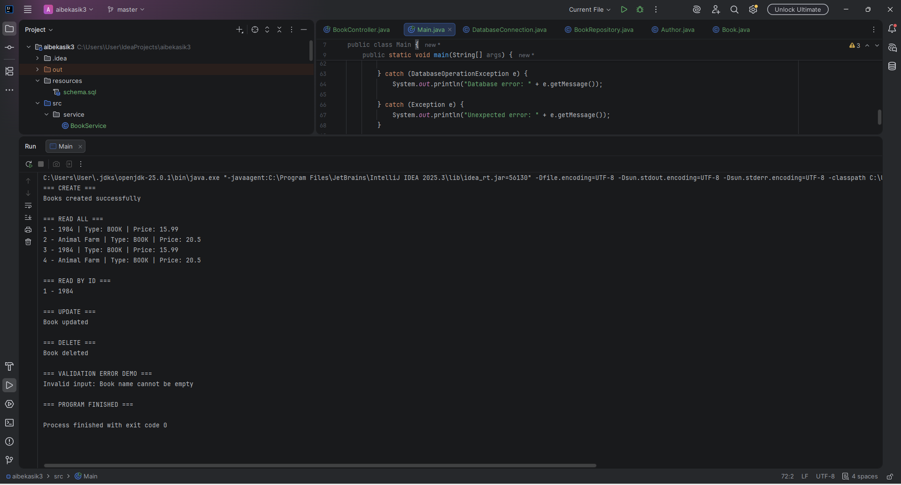
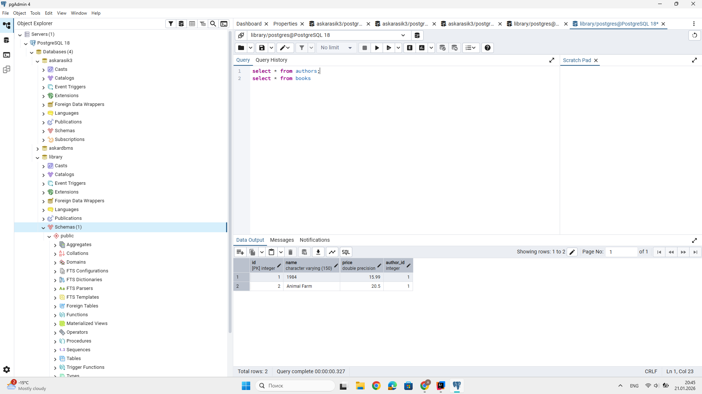
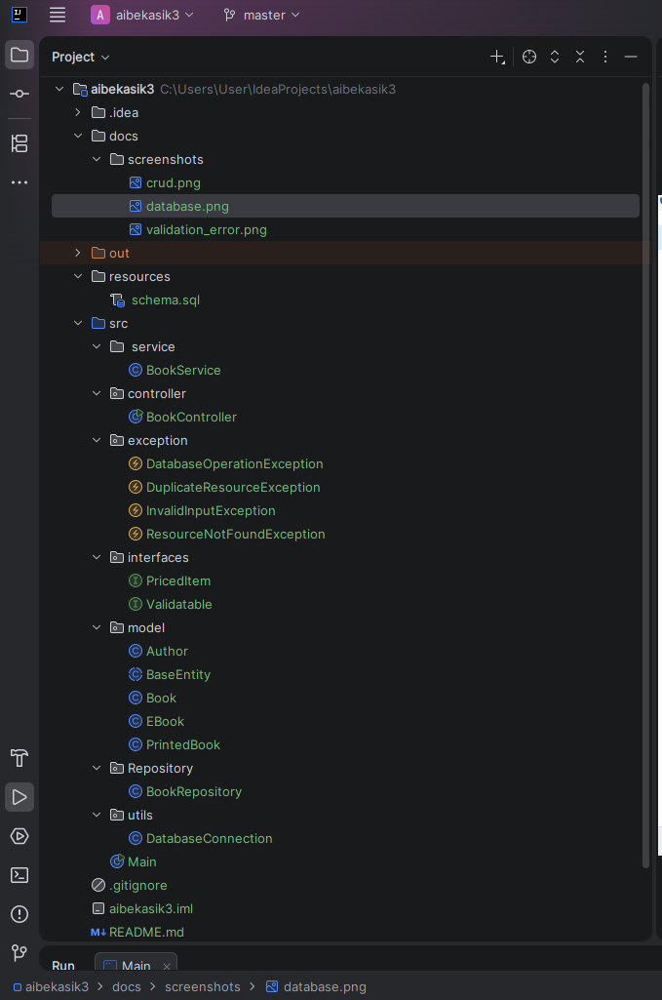

# 📚 Library Management API

**Java • JDBC • PostgreSQL • Advanced OOP**

---

## Project Overview

Library Management API is a console-based Java application that provides a REST-like API for managing books and authors using **JDBC** and **PostgreSQL**.

The project demonstrates:

* Object-Oriented Programming (OOP) principles
* JDBC-based interaction with a relational database
* Multi-layer application architecture
* Custom exception handling and validation

---

## Project Architecture

The application follows a layered architecture:

```
Controller → Service → Repository → PostgreSQL
```

* **Controller** – handles user interaction via CLI
* **Service** – contains business logic and validation
* **Repository** – performs CRUD operations using JDBC
* **Model** – defines entities and OOP hierarchy

---

## OOP Design

### Abstract Class

**BaseEntity**

* Fields: `id`, `name`
* Abstract methods:

    * `getType()`
    * `calculateValue()`
* Concrete method:

    * `info()`

---

### Inheritance

* `Book` extends `BaseEntity`
* `EBook` extends `Book`
* `PrintedBook` extends `Book`

Polymorphism is demonstrated by calling overridden methods through a base class reference.

---

### Interfaces

* `Validatable` – defines `validate()`
* `PricedItem` – defines `getPrice()`

Both interfaces are implemented in the `Book` class.

---

### Composition / Aggregation

* `Book` contains an `Author` object
* One author can be associated with multiple books

---

## Database Design

### Tables

**authors**

* `id` – PRIMARY KEY
* `name` – UNIQUE, NOT NULL

**books**

* `id` – PRIMARY KEY
* `name` – NOT NULL
* `price` – CHECK (price > 0)
* `author_id` – FOREIGN KEY → `authors(id)`

---

### SQL Schema (PostgreSQL)

```sql
CREATE TABLE authors (
    id SERIAL PRIMARY KEY,
    name VARCHAR(100) UNIQUE NOT NULL
);

CREATE TABLE books (
    id SERIAL PRIMARY KEY,
    name VARCHAR(150) NOT NULL,
    price DOUBLE PRECISION CHECK (price > 0),
    author_id INT REFERENCES authors(id)
);
```

---

### Sample Data

```sql
INSERT INTO authors (name) VALUES ('George Orwell');

INSERT INTO books (name, price, author_id)
VALUES ('1984', 15.99, 1);
```

---

## JDBC & CRUD Operations

The following CRUD operations are implemented for the `Book` entity:

* `create(Book book)`
* `getAll()`
* `getById(int id)`
* `update(int id, Book book)`
* `delete(int id)`

All database operations use **PreparedStatement**.
The `Statement` class is not used.

---

## Exception Handling

The project includes a custom exception hierarchy:

* `InvalidInputException`
* `DuplicateResourceException` (extends `InvalidInputException`)
* `ResourceNotFoundException`
* `DatabaseOperationException`

Exceptions are handled in the Controller layer.

---

## Controller Demonstration

The `BookController` demonstrates:

* creating books
* retrieving all books
* updating records
* deleting records
* handling validation errors
* handling database exceptions
* usage of polymorphism and interfaces

---

## How to Run

### Requirements

* Java 17 or higher
* PostgreSQL
* PostgreSQL JDBC Driver

### Steps

1. Create the database and execute `schema.sql`
2. Configure database credentials in `DatabaseConnection.java`
3. Run `BookController` or `Main`

---

## Screenshots

### CRUD Operations


### Validation Error


### Database Records


### Project Structure

---

## Reflection

### What I Learned

* working with JDBC without ORM frameworks
* designing a multi-layer application architecture
* applying OOP principles in practice
* implementing custom exception handling

### Challenges

* managing JDBC resources correctly
* ensuring proper error handling

### Benefits

* clean and maintainable architecture
* scalability
* clear separation of responsibilities

---


